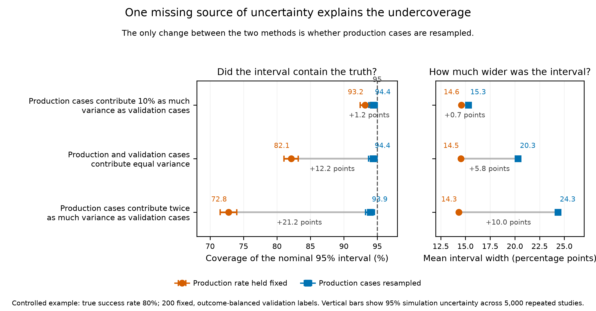
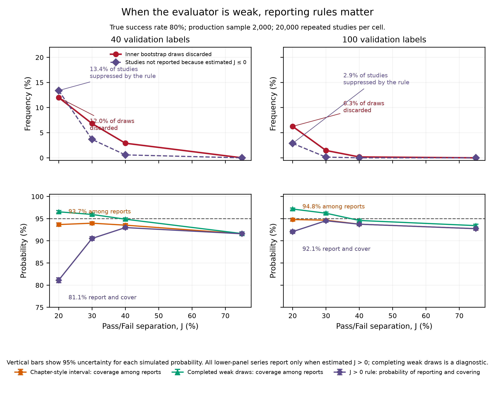

# What changes when the missing bootstrap components are added?

## The question

[Shankar and Husain](https://learning.oreilly.com/library/view/evals-for-ai/9798341660717/)
propose a practical way to correct an automated evaluator's
observed Pass rate using a smaller human-labelled validation set. Their
bootstrap resamples the paired human and evaluator labels, recomputes
sensitivity and specificity, and applies the Rogan--Gladen correction in every
draw.

That is a sensible starting point. It directly represents uncertainty in the
validation set and is easy to implement. The narrower question is whether the
resulting interval contains every source of uncertainty implied by the target
of inference.

This study reconstructs the proposed procedure and changes one component at a
time. The goal is not to declare the original method right or wrong in every
setting. It is to show which statistical question each version answers and how
the interval changes when additional components matter.

## When the original procedure is defensible

Holding the production evaluator rate fixed is coherent when the target is one
fully observed batch: *given these evaluator predictions, how much uncertainty
comes from estimating the evaluator's error rates?* The original procedure is
most defensible when:

- the production batch itself is the target, rather than a sample from an
  ongoing population;
- the validation resampling matches how the human labels were collected;
- the evaluator is comfortably better than chance; and
- sensitivity and specificity transport from validation to production.

The first experiment changes only the first condition. The second deliberately
examines what happens as the evaluator approaches chance performance.

## The component ladder

Let $\widehat q$ be the evaluator's production Pass rate,
$\widehat a$ its estimated sensitivity, $\widehat b$ its estimated
specificity, and $\widehat J=\widehat a+\widehat b-1$. The corrected rate is

$$
\widehat\theta=
\frac{\widehat q+\widehat b-1}{\widehat J}.
$$

| Step | What changes? | What does the change test? |
|---|---|---|
| Textbook baseline | Resample pooled validation pairs; hold $\widehat q$ fixed; discard undefined or nonpositive-denominator draws; constrain every retained draw to $[0,1]$. | The original calibration-conditional procedure. |
| Add production resampling | Also draw $q^*\sim\mathrm{Binomial}(m,\widehat q)/m$. | Whether a random production sample contributes material uncertainty. |
| Match fixed validation strata | Resample sensitivity and specificity within the fixed human-Pass and human-Fail strata. | Whether the bootstrap matches an outcome-balanced label design. |
| Complete weak draws | Retain negative-denominator ratios and apply one prespecified completion when the denominator is exactly zero. | What happens under one explicit interpretation of the reviewer's suggestion not to discard weak draws. |
| Constrain final endpoints | Take raw percentiles first and constrain only the displayed endpoints. | Whether clipping placement changes percentile endpoints. |

The weak-draw completion is an operational comparison, not a uniquely implied
or validated weak-identification interval.

## Study 1: resampling production cases

For inference about an ongoing production population, $\widehat q$ is a
binomial proportion. Its first-order contribution to the variance is

$$
\frac{q(1-q)}{mJ^2}.
$$

The textbook bootstrap holds $\widehat q$ fixed and therefore omits this
term. Study 1 varies the omitted production variance relative to the validation
variance while keeping the true success rate at 80% and using 200 fixed,
outcome-balanced validation labels.

| Production variance relative to validation variance | Coverage with production fixed | Coverage after production resampling | Mean width: fixed | Mean width: resampled |
|---|---:|---:|---:|---:|
| 10% as large | 93.2% | 94.4% | 14.6 points | 15.3 points |
| Equal | 82.1% | 94.4% | 14.5 points | 20.3 points |
| Twice as large | 72.8% | 93.9% | 14.3 points | 24.3 points |

The result supports the reviewer's first criticism. When production and validation
contributed equal first-order variance, adding production resampling raised
coverage by 12.2 percentage points. When production variance was twice as
large, the gain was 21.2 points. The interval became wider because it began to
represent uncertainty that was present in the population estimand all along.

This does not mean that production resampling is always required. For one fixed
batch, conditioning on all observed evaluator predictions can be the intended
analysis. The problem is using that conditional interval as though it were an
interval for repeated samples from an ongoing population.

## Study 2: discarded draws and weak evaluators

The original code discards bootstrap draws with no human-Pass or human-Fail
class, or with $J^*\le0$. The balanced designs used here make the missing-class
event effectively absent, so this experiment tests the denominator rule only.
It uses 20,000 repeated studies per cell and 1,000 bootstrap draws per study.

This distinction matters. With an observed 50/50 validation split, the pooled
bootstrap probability of losing one class is $2^{1-N}$, approximately
$1.6\times10^{-30}$ when $N=100$. That continuation statement is therefore
irrelevant in the textbook's displayed 50/50 setting. It can matter in an
imbalanced pooled sample: with 2 human-Pass and 18 human-Fail cases, the exact
probability is $0.9^{20}+0.1^{20}=12.2\%$. If the two class counts were fixed
by design, the correct response is to resample within each stratum, which makes
the missing-class event impossible.

| Validation labels | True $J$ | Weak draws discarded when an interval is attempted | Studies returning no ratio interval | Textbook coverage among reports | Textbook report-and-cover probability | Coverage with the prespecified weak-draw completion |
|---:|---:|---:|---:|---:|---:|---:|
| 40 | 0.20 | 12.0% | 13.4% | 93.7% | 81.1% | 96.5% |
| 40 | 0.30 | 6.8% | 3.7% | 94.0% | 90.5% | 95.9% |
| 100 | 0.20 | 6.3% | 2.9% | 94.8% | 92.1% | 97.2% |
| 100 | 0.30 | 1.5% | 0.1% | 94.7% | 94.5% | 96.2% |

Three points matter.

1. **Weak draws were not rare in this stress cell.** For 40 validation labels and
   $J=0.20$, 12.0% of the inner draws were removed even among studies for
   which the ratio interval was attempted.
2. **Conditional coverage can conceal nonreporting.** In the same cell, the
   textbook interval covered 93.7% of the time *when it returned an interval*,
   but the probability of both returning an interval and covering the truth was
   only 81.1%.
3. **A boundary rule changes the answer but does not solve identification.**
   The tested completion raised conditional coverage to 96.5% and widened the
   mean interval from 79.6 to 90.7 percentage points. It was conservative in
   this cell, but it still could not produce a regular ratio interval for the
   13.4% of studies whose observed $\widehat J$ was nonpositive.

The simulation shows why conditional coverage alone is insufficient, but it
does not establish a universal boundary correction or fully isolate every
effect of discarding. When the evaluator is this weak, the central problem is
weak identification: the evaluator is too close to chance for its error-rate
correction to reliably identify the true rate.

## Clipping result

Constraining every draw and constraining only the final percentile endpoints
gave the same empirical coverage in all eight cells, and their mean widths
differed by less than 0.002 percentage points. This is expected
for a monotone projection onto $[0,1]$: percentile quantiles and monotone
projection generally commute, apart from negligible interpolation details.

That result does not prove that percentile inference is reliable at a
boundary. It shows that clipping placement is not the main issue for the
displayed percentile endpoints. A dedicated boundary study should compare the
bootstrap with a likelihood-based interval and should record the raw mass below
zero and above one.

## Where PPBoot fits

[Zrnic's prediction-powered bootstrap](https://arxiv.org/abs/2405.18379)
resamples both labelled and unlabelled samples. It therefore contains the two
sampling components that matter for a random production population. It is an
important adjacent method, but not a one-line replacement here: PPBoot changes
the estimator to a prediction-powered rectifier and, in its basic form, assumes
representative labelled observations from the same target distribution.
Fixed outcome-balanced validation labels require design weights or a stratified
extension.

## What this establishes

- The missing-production-variance criticism is correct for a random
  production-population estimand and quantitatively important when that source
  of variation is not small.
- The original procedure remains interpretable as a narrower, fixed-batch,
  calibration-conditional analysis.
- Weak bootstrap denominators and nonreporting should be disclosed. Coverage
  among successful runs is not enough.
- The tested weak-draw completion is informative as an ablation but is not a
  validated solution to weak identification.
- Matching the bootstrap to the label-acquisition design is necessary even
  when its numerical effect is small in a particular regular cell.
- More bootstrap draws reduce numerical error; they do not restore an omitted
  random component or repair changed evaluator accuracy.

The full numerical evidence is in
[`journal_summary.csv`](results/journal_final/journal_summary.csv) and
[`component_summary.csv`](results/component_ablation/component_summary.csv).
The implementations are
[`journal_study.py`](journal_study.py) and
[`component_ablation_study.py`](component_ablation_study.py).
