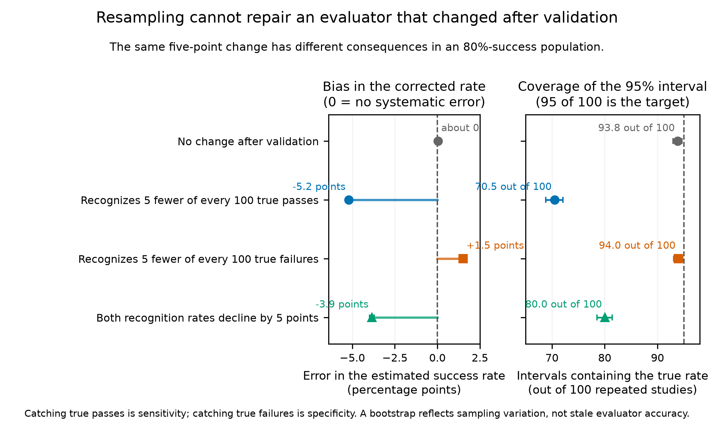

# Key results

## Bottom line

A bootstrap is only as complete as its resampling design. If production cases
are a random sample from an ongoing population, holding their observed judge
pass rate fixed omits real sampling uncertainty. Separately, even a complete
bootstrap cannot correct evaluator error rates that no longer transport from
validation to production.

## Result 1: resample random production cases

The first experiment uses an 80% true success rate and 200 human-labelled
validation cases. A valid 95% interval should contain the true rate in about 95
of 100 repeated studies.

| Production uncertainty relative to validation uncertainty | Production rate held fixed | Production and validation resampled |
|---|---:|---:|
| 10% as large | 93.2% | 94.4% |
| Equal | 82.1% | 94.2% |
| Twice as large | 72.8% | 94.0% |

When the omitted source of uncertainty became material, the incomplete
bootstrap produced intervals that were much too confident. The design-matched
bootstrap remained close to its intended 95% coverage.

## Result 2: a bootstrap cannot repair calibration drift

The second experiment keeps the true success rate at 80% and changes the
evaluator's production sensitivity, specificity, or both by five percentage
points after validation.

| Change after validation | Bias in corrected rate | Coverage of nominal 95% interval |
|---|---:|---:|
| No change | approximately 0.0 points | 93.8% |
| Sensitivity declines by 5 points | -5.2 points | 70.5% |
| Specificity declines by 5 points | +1.5 points | 94.0% |
| Both decline by 5 points | -3.9 points | 80.0% |

Sensitivity drift mattered more here because 80% of cases truly passed. In a
low-success population, specificity drift could be more consequential.

## Practical decisions

- Resample production cases when the estimand concerns an ongoing or future
  production population.
- Holding a fully observed batch fixed can be appropriate when that batch is
  itself the target.
- Use fresh human labels or a defensible bridge study when evaluator accuracy
  may have changed.
- Do not interpret additional bootstrap draws as protection against systematic
  evaluator error, sample-selection bias, or calibration drift.

## Evidence record

- `journal_summary.csv` contains 252 full-precision summaries.
- Study A used 5,000 outer replications per cell.
- Study B used 3,000 outer replications per cell.
- Every interval used 1,000 bootstrap draws.
- A six-cell stability check with 5,000 bootstrap draws changed coverage by at
  most 0.32 percentage points.
- No weak-denominator or discarded-draw events occurred in the final grid.

See [`TECHNICAL_RESULTS.md`](TECHNICAL_RESULTS.md) for assumptions, formulas,
the complete parameter grid, Monte Carlo checks, and technical figures.
