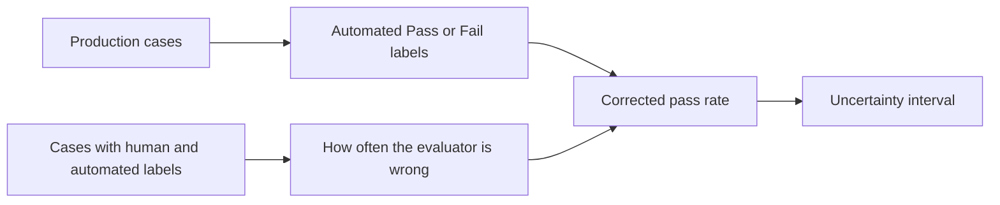

# When can we trust uncertainty from an automated evaluator?

Automated evaluators can score far more cases than people can review. They also
make mistakes. A common approach is to use a smaller human-reviewed sample to
correct the automated pass rate. A bootstrap then repeatedly resamples the
observed data to show how much that corrected rate could change.

If that interval is too narrow or centred on the wrong value, a team can become
confident in an evaluator or system that has not earned that confidence.

This repository asks a narrow question:

> Does the bootstrap include every source of variation that matters for the
> question we want to answer?

## Summary

We learned three things.

1. **A bootstrap can miss substantial uncertainty if it holds a random
   production sample fixed.** In one experiment, the original interval
   contained the true rate only 82.1% of the time. Resampling the production
   cases raised this to 94.4%, close to the intended 95%.
2. **A weak evaluator makes the correction unstable, and the reporting rule
   becomes part of the result.** In the hardest tested setting, 12.0% of the
   original method's bootstrap draws were discarded. A separate rule that
   reported an interval only when estimated $J$ was above zero
   suppressed 13.4% of repeated studies.
3. **No bootstrap can repair outdated information about evaluator accuracy.**
   When the evaluator became five percentage points worse at recognizing true
   passes, the corrected rate was 5.2 points too low and interval coverage fell
   to 70.5%.

**A bootstrap only measures the variation that its resampling procedure
repeats.** It cannot account for a random input that is held fixed, and it
cannot correct a wrong assumption about evaluator accuracy.

## What were we trying to show?

The original procedure in Shankar and Husain's
[Chapter 5 of *Evals for AI Engineers*](https://learning.oreilly.com/library/view/evals-for-ai/9798341660717/)
aims to estimate performance on new, unlabelled production cases. Its bootstrap
resamples the human-reviewed validation cases but holds the automated pass rate
in the production sample fixed.

The narrow question mathematically supported by that resampling is:

> Given the automated labels already observed for this batch, how much does our
> answer vary because we estimated the evaluator's error rates from a small
> human-reviewed sample?

That calculation is sensible if the automated labels are deliberately treated
as fixed. It is not, by itself, an interval for the unknown human pass rate in
the fixed batch. Nor does it answer the broader population question that
motivates the chapter:

> If we drew another set of production cases from the same ongoing process, how
> much would the corrected pass rate vary?

Our first goal was to measure the difference between these two questions. The
later experiments asked what happens when the evaluator is close to random
guessing, and when its measured accuracy no longer applies in production.

Jointly resampling labelled and unlabelled data is not new;
[PPBoot](https://arxiv.org/abs/2405.18379) already does this for a different,
prediction-powered estimator. The contribution here is narrower: we quantify
what the chapter-style error-rate correction misses, and show why the question
being asked and the way human labels were collected determine the right
procedure.

## The setup, without the statistical shorthand

The common application combines two sources of information:

- A large production sample receives automated Pass or Fail labels.
- A smaller validation sample receives both automated labels and human labels.

The human labels show how often the evaluator misses a true pass or a true
failure. We use those error rates to correct the automated pass rate with the
[Rogan–Gladen correction](https://pubmed.ncbi.nlm.nih.gov/623091/).



The diagram hides one decision that changes the meaning of the final interval:
which parts of this process would change if we repeated the study?

| Question being answered | What the bootstrap should repeat |
|---|---|
| Conditional on one fixed set of automated labels, how much uncertainty comes from the estimated error rates? | The human-reviewed validation sample |
| The batch is a sample from an ongoing population | Both the production sample and the validation sample |

The first row asks only how uncertain error-rate estimates change the answer
after the automated labels are fixed. It should not be read as a general
confidence interval for the fixed batch's unknown human pass rate.

## Result 1: a random production sample must be resampled

If the production cases come from an ongoing stream, their automated pass rate
will change from sample to sample. Holding that rate fixed removes a real source
of uncertainty.


The figure uses an 80% true human-defined success rate and 200 human-reviewed
validation cases. The horizontal axis is the ratio of the production-sample
variance to the validation-sample variance.

| Production variance relative to validation variance | Production rate held fixed | Production rate resampled |
|---|---:|---:|
| 0.1 times as large | 93.2% | 94.4% |
| Equal | 82.1% | 94.4% |
| Twice as large | 72.8% | 93.9% |

An interval designed for 95% coverage should contain the true value in about 95
out of 100 repeated studies. The error was smaller when the omitted variance
was small, though 93.2% was still below the intended 95%. The interval became
much too confident as the omitted variance grew.

Before choosing the bootstrap, decide whether the target is a fixed batch or an
ongoing population. Neither choice is always right. They answer different
questions.

## Result 2: weak evaluators make the correction and its reporting rule fragile

The correction divides by a measure of the evaluator's net ability to
distinguish Pass from Fail at the chosen threshold. We denote it by $J$:

$$
J = \text{sensitivity} + \text{specificity} - 1.
$$

Sensitivity is the fraction of true passes recognized as Pass. Specificity is
the fraction of true failures recognized as Fail. If $J$ is close to zero, the
evaluator has little net ability to distinguish the two groups and the
correction becomes unstable. A constant classifier can also have $J=0$, so
this condition is broader than literal random guessing.


Two different events appear in this experiment:

- Some simulated bootstrap draws have $J$ equal to or below zero. The
  original code discards them.
- The stress study also imposed a reporting rule: do not report the usual
  corrected-rate interval when the observed $J$ is zero or negative. The
  correction is undefined at zero. It still exists below zero, but the rule
  excludes that case because the evaluator no longer has positive separation
  between Pass and Fail.

With 40 validation labels and a true $J$ of 0.20, the original method discarded
12.0% of its bootstrap draws among studies where it attempted an interval.
Under the added positive-$J$ reporting rule, 13.4% of repeated studies
were suppressed. The interval contained the truth 93.7% of the time *when the
rule allowed reporting*, but the chance of both reporting an interval and
covering the truth was only 81.1%.

The literal chapter implementation does not contain this outer reporting rule.
The 13.4% result therefore measures a transparent policy choice, not a failure
caused by discarding inner bootstrap draws.

The chapter itself warns that the correction is unreliable when $J$ is near
zero, recommends keeping the evaluator fixed during measurement, and treats
drift as a practical risk. These experiments put numbers on those warnings;
they do not claim to discover them.

We also tested one explicit rule for keeping the problematic bootstrap draws.
It retained corrected values when $J$ was negative and assigned a value only
when $J$ was exactly zero. It produced wider intervals, but the separate outer
reporting rule still suppressed studies whose observed $J$ was not positive.
This is a diagnostic comparison, not a recommended solution.

Report how often an interval could not be computed and how often bootstrap
draws were removed. Coverage among successful runs can make a fragile method
look healthier than it is.

## Result 3: resampling cannot repair outdated evaluator accuracy

The correction assumes that the evaluator makes the same kinds of errors in
validation and production. The third experiment deliberately breaks that
assumption.


The true human-defined success rate is again 80%.

| Change after validation | Error in the corrected rate | How often the 95% interval contained the truth |
|---|---:|---:|
| No change | About 0.0 points | 93.8% |
| Recognizes five fewer true passes per 100 | 5.2 points too low | 70.5% |
| Recognizes five fewer true failures per 100 | 1.5 points too high | 94.0% |
| Both abilities decline by five points | 3.9 points too low | 80.0% |

The direction matters. In this example, 80% of cases truly pass, so a decline
in recognizing passes affects more cases than the same decline in recognizing
failures.

More bootstrap draws cannot make old validation results describe a changed
evaluator or a changed population. That requires fresh human labels or a study
that connects the old and new settings.

## A smaller result: clipping was not the problem here

The original code forces every corrected bootstrap value into the range from 0
to 1. We compared that with taking the percentiles first and constraining only
the two displayed endpoints.

The two choices gave identical coverage in all eight tested settings. Their
average interval widths differed by less than 0.002 percentage points. That is
an empirical result for these settings, not a general identity: the software's
interpolated percentiles can differ depending on whether clipping happens
before or after the percentile is calculated.

This result does not prove that ordinary percentile intervals work well near a
boundary. It only shows that the location of the clipping step was not driving
the results in this experiment.

## Did the study succeed?

Yes, for its three narrow claims:

- It isolated the uncertainty omitted when a random production sample is held
  fixed.
- It quantified discarded draws and showed how an explicit reporting rule can
  make coverage calculated only among reported intervals hide nonreporting.
- It measured the bias caused by changes in evaluator accuracy after
  validation.

No, it did not settle the broader question of which estimator should be used in
every automated-evaluation setting. In particular, it did not compare this
error-rate correction with a prediction-powered difference estimator under
matched data-collection designs. That is the most useful next experiment.

## Which review questions are settled?

| Question raised in the review | Current answer |
|---|---|
| Does holding the production rate fixed omit uncertainty? | **Yes, for an ongoing-population target. Tested directly.** Holding it fixed answers only how estimated error rates change an answer after automated labels are fixed. It is not general inference for a fixed batch's unknown human pass rate. |
| What happens when draws with $J\leq0$ are discarded? | **Partly settled.** We measured discarded draws. The nonreporting result comes from a separate explicit reporting rule, and the study did not isolate a causal effect of discarding on coverage. |
| Does clipping every draw change the percentile interval? | **Not materially in the eight tested settings.** Boundary inference remains a separate question. |
| How large is finite-sample ratio bias when the evaluator is weak? | **Still open in the weak-evaluator study.** The study reports coverage and reporting failures, but not the requested bias analysis. |
| What if evaluator accuracy changes after validation? | **Tested in a controlled sensitivity analysis.** The resulting bias can be large and cannot be repaired by resampling. |
| Does the way human labels were collected matter? | **Yes.** We matched the bootstrap to fixed Pass and Fail validation counts, but have not yet compared different label-collection designs. |
| What about clustered cases, repeated judge calls, or disagreement between human reviewers? | **Not studied.** |
| What if the evaluator provides a useful score rather than only Pass or Fail? | **Not studied.** |

## Assumptions used in these simulations

These are choices made for the experiments, not claims about every real system.

- The outcome and evaluator label are both Pass or Fail.
- The validation data contain fixed numbers of human-defined passes and
  failures.
- The validation and production samples are separate and independent.
- Cases are independent rather than grouped by user, conversation, or prompt
  template.
- Each case receives one evaluator label, and the human label is treated as the
  reference answer.
- The target is one success rate, not a comparison between systems or time
  periods.

A real application must answer these design questions before choosing an
estimator or a bootstrap. If the answers differ, the analysis must change too.

## What should be studied next?

The next experiment should compare two complete data-collection strategies at
the same total human-review cost, including any screening needed to obtain fixed
numbers of Pass and Fail cases:

1. fixed numbers of human Pass and Fail cases with the error-rate correction
   studied here; and
2. a representative human sample with
   [PPBoot](https://arxiv.org/abs/2405.18379), which combines cheap automated
   predictions with human labels from the same target population.

If the human sample is collected with unequal probabilities, a separate
[weighted or stratified prediction-powered method](https://proceedings.neurips.cc/paper_files/paper/2024/hash/c9fcd02e6445c7dfbad6986abee53d0d-Abstract-Conference.html)
is needed; basic PPBoot does not solve that design problem by itself.

That comparison would answer the question the current work leaves open: which
combination of label-collection design and estimator achieves near-95% coverage
with the narrowest interval for a stated total collection cost?

Later studies can address clustered cases, repeated evaluator calls, human
disagreement, continuous evaluator scores, and comparisons between systems.
Those extensions matter, but they should not be mixed into the first comparison
until the basic design question is settled.

## Where the details live

- [`KEY_RESULTS.md`](KEY_RESULTS.md) gives the main numerical results in a short
  format.
- [`BOOTSTRAP_COMPONENT_STUDY.md`](BOOTSTRAP_COMPONENT_STUDY.md) explains the
  component-by-component comparison.
- [`METHOD.md`](METHOD.md) defines the estimator and simulation designs.
- [`TECHNICAL_RESULTS.md`](TECHNICAL_RESULTS.md) records the full grids,
  formulas, checks, and technical figure captions.
- [`journal_study.py`](journal_study.py) runs the production-sampling and
  calibration-change experiments.
- [`component_ablation_study.py`](component_ablation_study.py) runs the
  weak-evaluator and clipping experiments.

## Reproduce the studies

Create a virtual environment and install NumPy and Matplotlib:

```bash
python3 -m venv .venv
source .venv/bin/activate
python3 -m pip install -r requirements.txt
```

Run the main report-scale studies:

```bash
python3 -c "import journal_study as js; print(js.run_final())"
```

Run the weak-evaluator study separately:

```bash
python3 component_ablation_study.py
```

The scripts are deliberately small and have no command-line interface. The
saved CSV files contain the full-precision values behind the figures.
